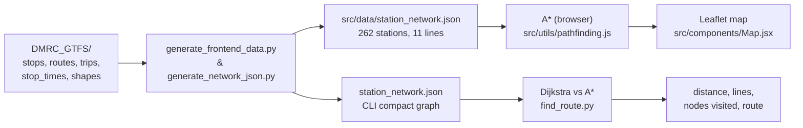

# TERMINAL_DMRC


> A neon terminal-styled route planner that finds the fastest path across the **Delhi Metro (DMRC)** network — for transit riders, students of graph algorithms, and anyone who likes their maps glowing.

**Live demo:** https://terminal-dmrc.pages.dev

TERMINAL_DMRC turns the official Delhi Metro GTFS feed into a weighted transit graph and runs **A\* pathfinding** (with a Haversine heuristic) to compute the shortest route between any two of **262 stations** across **11 lines**. The result renders on an interactive Leaflet map inside a cyberpunk "Command Center" UI, while a small Python CLI runs both Dijkstra and A\* side-by-side so you can watch the heuristic prune the search space in real time.

---

## ✨ Features

- **Shortest-path routing** across the full DMRC network using A\* with a great-circle (Haversine) heuristic, minimizing distance in kilometres.
- **Interactive Leaflet map** drawing all 11 lines in their official colours, with station markers, glowing polylines, and a highlighted itinerary.
- **Cyberpunk terminal UI** — neon green-on-black, scanline overlay, Material Symbols, and a mobile-responsive sidebar/map toggle.
- **Algorithm bench harness** in the CLI: runs Dijkstra *and* A\* on every query and prints nodes-visited and elapsed time so the speedup is visible.
- **GTFS → graph pipeline** built from Python's standard library only — no pip dependencies for the data layer.
- **Circular-line aware**: the Pink Line loop is detected and closed automatically so A\* can traverse it in either direction.
- **Network validator** that checks edge bidirectionality and circular-line closure before you ship a new dataset.

---

## 📦 Installation

### Prerequisites

| Tool | Version | Used for |
|---|---|---|
| Node.js + npm | 18+ | React frontend |
| Python | 3.8+ | Data generators + route CLI (stdlib only) |

### Frontend (the web app)

The React app lives at the **repository root** (not in a subfolder).

```bash
npm install
npm run dev
```

Vite prints a local URL (usually `http://localhost:5173`). Open it, pick a start and end station, and hit **Find Route**.

### Python data tooling

No third-party packages are required — the scripts use only the standard library.

```bash
python3 --version
```

If the bundled `src/data/station_network.json` ever needs regenerating from the raw GTFS, see [Configuration](#️-configuration).

---

## 🚀 Usage

### Web app

```bash
npm run dev
```

Type a station name in either box (autocomplete narrows as you type), select it, press **Find Route**, and the itinerary — total distance, number of stops, lines used, and an ordered station list — appears beside the highlighted map path.

### CLI route finder

The CLI benchmarks Dijkstra against A\* and prints the comparison:

```bash
python3 find_route.py "Rajiv Chowk" "Noida City Centre"
```

Sample output:

```text
Finding shortest route from Rajiv Chowk to Noida City Centre...

Total Distance: 17.09 km
Lines: Blue
Number of Stations: 16

--- Algorithm Comparison ---
Algorithm  | Nodes Visited   | Time (ms)
----------------------------------------
Dijkstra   | 153             | 0.181
A*         | 23              | 0.091

A* visited 85.0% fewer nodes.

Route:
Rajiv Chowk -> Barakhamba -> Mandi House -> ... -> Noida City Centre
```

> [!NOTE]
> Elapsed times are machine-dependent; the nodes-visited counts are deterministic for a given dataset.

---

## ⚙️ Configuration

`generators_config.json` (repo root) controls the network generators and validator.

| Key | Default | Description |
|---|---|---|
| `circular_lines` | `["Pink"]` | Lines treated as loops; their shape is closed and a last→first edge is added. |
| `circular_threshold_km` | `0.3` | If a shape's first and last points are within this distance, it is detected as circular. |
| `add_reverse_edges` | `true` | Make every adjacency bidirectional in the graph. |

Override the config path with `--config`:

```bash
python3 generate_frontend_data.py --config generators_config.json
python3 generate_network_json.py --config generators_config.json
python3 validate_network.py --network src/data/station_network.json --config generators_config.json
```

---

## 🧱 Architecture / How it works



**Data flow.** Python parses the GTFS CSVs into a graph: each station is a node carrying coordinates + line codes; adjacent stops on the same trip become weighted edges (distance in km, tagged with their line). Reverse edges are added so travel is bidirectional.

**Pathfinding.** The frontend (`src/utils/pathfinding.js`) and CLI (`find_route.py`) both implement A\* with a Haversine great-circle heuristic. The CLI additionally runs Dijkstra to quantify how many nodes the heuristic eliminates.

### Repository layout

```
src/
├── components/
│   ├── Header.jsx      # Terminal header, status bar
│   ├── Sidebar.jsx     # Station autocomplete + itinerary
│   └── Map.jsx         # Leaflet map: lines, markers, route
├── data/
│   └── station_network.json   # Pre-built graph for the web app
└── utils/
    └── pathfinding.js  # A* with Haversine heuristic

DMRC_GTFS/              # Raw GTFS source feed
find_route.py           # CLI: Dijkstra vs A* benchmark
generate_frontend_data.py  # Builds src/data/station_network.json (shapes + colours)
generate_network_json.py  # Builds root station_network.json (compact, for CLI)
validate_network.py     # Checks bidirectional edges + circular-line closure
generators_config.json  # Generator/validator options
```

### Network JSON shape

```json
{
  "stations": {
    "Rajiv Chowk": {
      "name": "Rajiv Chowk",
      "line_codes": ["Blue", "Yellow"],
      "coords": { "lat": 28.632896, "lon": 77.219574 }
    }
  },
  "edges": {
    "Rajiv Chowk": [{ "to": "Barakhamba", "distance": 0.63, "line": "Blue" }]
  },
  "lines": {
    "Blue": { "color": "#0000FF", "paths": [[[28.632759, 77.219688], [28.632254, 77.220619]]] }
  }
}
```
---

## 🤝 Contributing

Contributions are welcome. Useful starting points: a binary-heap priority queue for the frontend A\*, travel-time / transfer-penalty modelling, and rendering routes along exact GTFS track shapes instead of straight chords between stations. Open an issue to discuss a change before opening a pull request.

---

## 📄 License

No `LICENSE` file is present in this repository, so the code is **all rights reserved** by default. Add an explicit license (e.g. MIT, Apache-2.0) before redistributing it.
